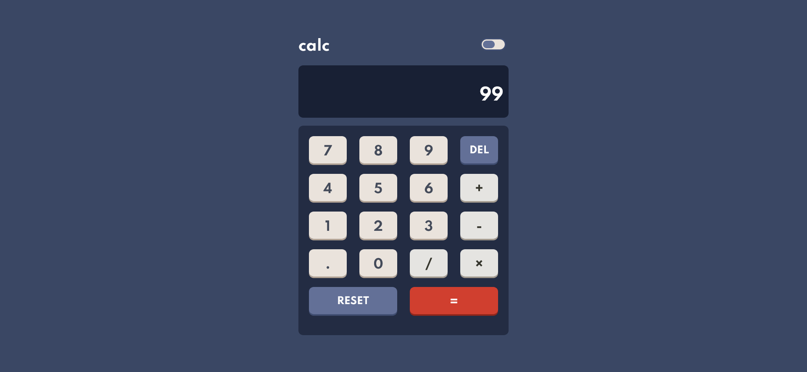
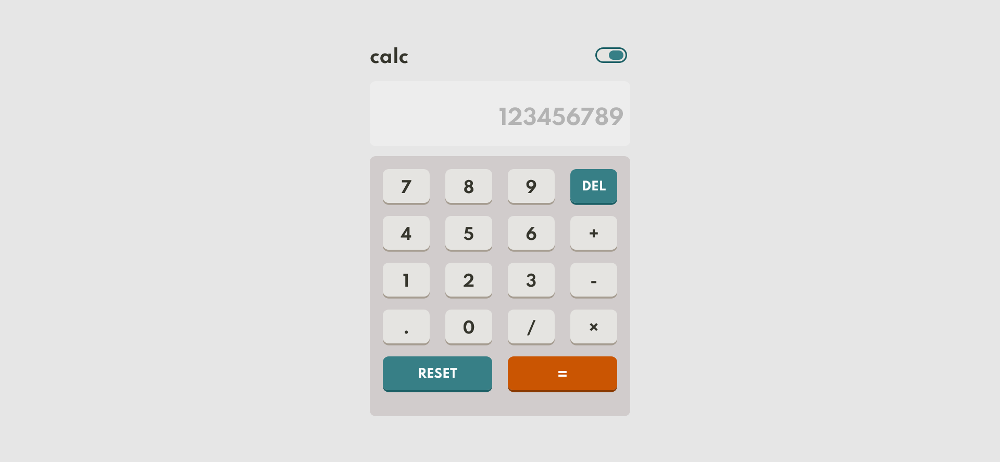

# Frontend Mentor - Calculator app solution

  

This is a solution to the [Calculator app challenge on Frontend Mentor](https://www.frontendmentor.io/challenges/calculator-app-9lteq5N29). Frontend Mentor challenges help you improve your coding skills by building realistic projects.

  

## Table of contents

  

-  [Overview](#overview)

-  [The challenge](#the-challenge)

-  [Screenshot](#screenshot)

-  [Links](#links)

-  [My process](#my-process)

-  [Built with](#built-with)

-  [What I learned](#what-i-learned)

-  [Useful resources](#useful-resources)

-  [Author](#author)

  

## Overview

  

### The challenge

  

Users should be able to:

  

- See the size of the elements adjust based on their device's screen size

- Perform mathmatical operations like addition, subtraction, multiplication, and division

- Adjust the color theme based on their preference

-  **Bonus**: Have their initial theme preference checked using `prefers-color-scheme` and have any additional changes saved in the browser

  

### Screenshot

  

  

### Links

  

- Solution URL: [Add solution URL here](https://github.com/Devang47/Project-15-Minimal-calc/tree/main/design)

- Live Site URL: [Add live site URL here](https://dazzling-kepler-73a55a.netlify.app/)

  

## My process

  

### Built with

  

 - Semantic HTML5 markup

 - CSS custom properties

 - Flexbox

 - CSS Grid

 - Desktop-first workflow (by mistake)

 - Simple JS

  

### What I learned

  

During the making of this Webapp I learned many things like CSS Grids and eval func. in JS and I came accross many small bugs and solved them.
 

## Author

  

- Name - Devang Saklani

- Frontend Mentor - [@Devang47](https://www.frontendmentor.io/profile/@Devang47)

